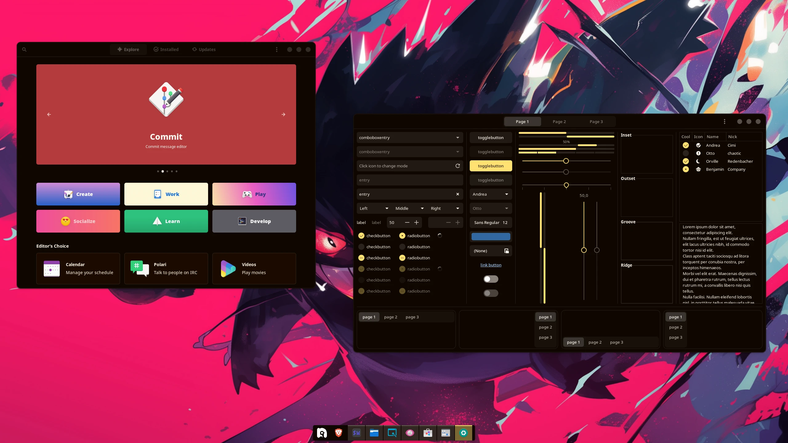
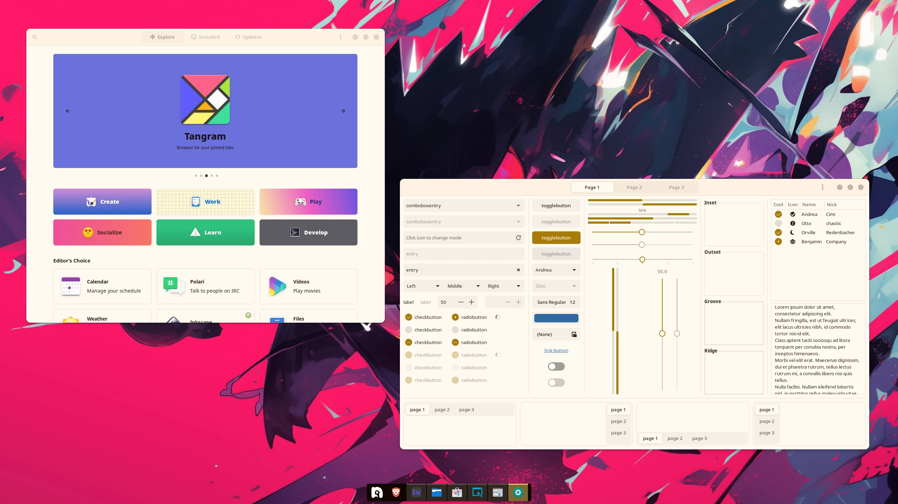

<div align="center">


### Whiskers for [GTK](https://www.gtk.org/)

<div>
    
    
</div>
</div>

## 👷‍♂️ Install

- Download the prefered theme in the [releases](https://github.com/Whiskers-Color-Scheme/gtk/releases/) page

- Extract the theme

- Copy the folder content to `.themes` folder
```bash
mkdir -p ~/.themes; cp -r Whiskers-Panther-Banana/* ~/.themes #Change the folder name to your downloaded theme
```         

- To use in libadwaita copy the content from the `gtk-4.0` folder to the config folder
```bash
cp -r Whiskers-Panther-Banana/Whiskers-Banana-Panther/gtk-4.0/* ~/.config/gtk-4.0
```

- Finally use gnome tweaks or anything available to apply the theme 😄

## 💻 Maintainers

- [lighttigerxiv](https://github.com/lighttigerxiv)

